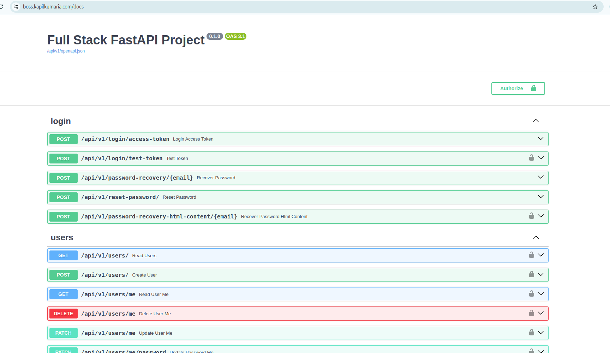
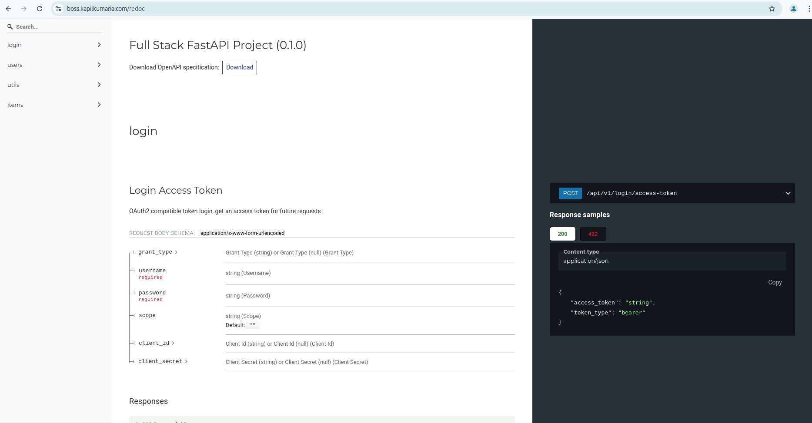
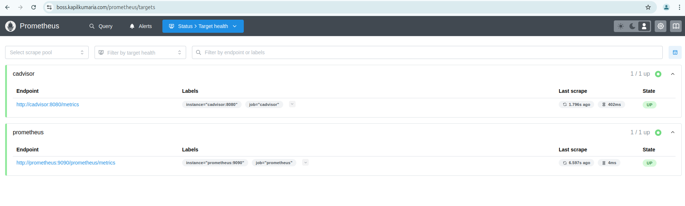
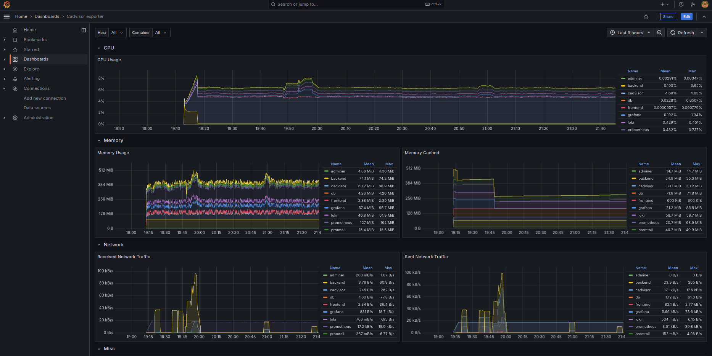

## Full Stack Application with Monitoring and Logging

This project sets up the infrastructure for the Full Stack application using Docker Compose, Traefik, and AWS Route53. The setup includes a frontend, backend, database, and monitoring services with Traefik managing SSL certificates and path-based routing.

## Project Structure

The project is organized into the following structure:

- `application/`: Contains the application stack (Contains frontend and backend). Also contains configuration files for monitoring services such as Prometheus, Grafana, Loki, cAdvisor and Promtail. 
- `frontend/`: Contains the source code for the frontend. Contains the ReactJS application.
- `backend/`: Contains the source code for the backend. Contains the FastAPI application and PostgreSQL database integration.
- `traefik/`: Contains configuration files for the Traefik proxy.
```
➜  cv-challenge01 git:(main) ll
    -rw-rw-r-- 1 ubuntu ubuntu 1.1K Dec  5 01:57 LICENSE
    -rw-rw-r-- 1 ubuntu ubuntu 9.3K Dec  5 04:40 README.md
    drwxrwxr-x 4 ubuntu ubuntu 4.0K Dec  5 02:12 application
    drwxrwxr-x 3 ubuntu ubuntu 4.0K Dec  5 01:57 backend
    -rw-rw-r-- 1 ubuntu ubuntu  221 Dec  5 01:57 docker
    drwxrwxr-x 4 ubuntu ubuntu 4.0K Dec  5 01:57 frontend
    drwxrwxr-x 2 ubuntu ubuntu 4.0K Dec  5 04:42 images
    drwxrwxr-x 3 ubuntu ubuntu 4.0K Dec  5 01:57 traefik
```
```
➜  cv-challenge01 git:(main) tree -L 1 frontend 

frontend
├── Dockerfile
├── README.md
├── biome.json
├── index.html
├── modify-openapi-operationids.js
├── nginx.conf
├── package-lock.json
├── package.json
├── public
├── src
├── tsconfig.json
├── tsconfig.node.json
└── vite.config.ts
```
```
cv-challenge01 git:(main) ✗ tree -L 1 backend 

backend
├── Dockerfile
├── README.md
├── alembic.ini
├── app
├── poetry.lock
├── prestart.sh
└── pyproject.toml
```
```
➜  cv-challenge01 git:(main) tree application
application
├── docker-compose.yml
├── grafana.yaml
├── html
│   └── index.html
├── loki-config.yaml
├── loki-config.yml
├── nginx.conf
├── prometheus.yaml
└── promtail-config.yaml
```
```
➜  cv-challenge01 git:(main) tree traefik 
traefik
└── letsencrypt
    └── acme.json
```

## Features

1. **Traefik Proxy**:
   - Handles path-based routing for all services.
   - Automatically issues SSL certificates via Let's Encrypt.

2. **Route53 Domains**:
   - Two A records are set up for the domain:
     - `www.boss.kapilkumaria.com`
     - `boss.kapilkumaria.com`

3. **Monitoring**:
   - Prometheus, Grafana, Loki, and Promtail for application monitoring and logging.

## Prerequisites

### Configure Environment Variables(Optional):

    Adjust database credentials in the backend/.env file.
    Configure Traefik with the domain names in the docker-compose.yml file.

### Prometheus(Optional):

- You can add additional data source with the URL: http://prometheus:9090/prometheus

### Loki(Optional):

- You can add a new data source with the URL: http://loki:3100

---

# How to Use This Repository

Follow the steps below to set up and deploy the services defined in this repository:

### Step 1: AWS - EC2 Instance Ubuntu, t2.medium with 50GiB Storage Volume

### Step 2: Clone the Repository
Ensure Docker and Docker Compose are installed on server

### Step 3: Clone the Repository

Clone this repository to your server to access the application and configuration files.
```
git clone https://github.com/kapilkumaria/cv-challenge01.git
```
### Step 4: Navigate to the Application Directory

Move into the application folder where the main docker-compose.yml file is located.
```
cd cv-challenge01/application
```
### Step 5: Create a Docker Network

Create a Docker network named app_network. This network ensures seamless communication between the containers.
```
docker network create app_network
```
## Step 6: Secure the ACME Configuration

Ensure that the acme.json file (used by Traefik for Let's Encrypt certificates) has the correct permissions for security.
```
chmod 600 cv-challenge01/traefik/letsencrypt/acme.json
```
    Note: Incorrect permissions may prevent Traefik from functioning properly and could expose sensitive certificate data.

### Step 7: Configure DNS Settings

Point the A records to your server's IP address.
Add the following A records in your AWS Route 53 hosted zone (or equivalent DNS management service) to point to your server's public IP address:
```
www.<your-domain>
<your-domain>

e.g.

www.boss.kapilkumaria.com
boss.kapilkumaria.com

# The domain www.boss.kapilkumaria.com is automatically redirected to HTTPS by Traefik, which acts as the reverse proxy for this application. Traefik is configured to enforce HTTPS for all incoming traffic, ensuring secure communication between the client and the server.
```
    Tip: Ensure that your DNS changes propagate correctly by verifying them with tools like nslookup or dig.

### Step 8: Run the Application (Deploy Services with Docker Compose)

Use Docker Compose to build and deploy the services defined in the docker-compose.yml file. The -d flag runs the containers in detached mode.
```
docker compose up -d --build
# Rebuild the images before starting the containers. Ensure that any changes made to the Dockerfile or other build context (e.g., code files or dependencies) are applied to the services.

docker compose up -d
# Use existing images as-is without rebuilding them.
```
    Best Practice: Always review the logs after deployment using docker compose logs to ensure all services are running as expected.

### Step 9: Access the Application

Once the services are running, access the deployed application through the following URLs:

Main Application: https://www.boss.kapilkumaria.com

Adminer (Database Management): https://www.boss.kapilkumaria.com/adminer

API Documentation (Swagger UI): https://www.boss.kapilkumaria.com/docs

API Documentation (ReDoc): https://www.boss.kapilkumaria.com/redoc

Monitoring (Prometheus): https://www.boss.kapilkumaria.com/prometheus

Dashboard (Grafana): https://www.boss.kapilkumaria.com/grafana

<!----  -->




<!----  -->

## Traefik Configuration

- SSL certificates for boss.kapilkumaria.com are automatically issued via Let's Encrypt.
- HTTP to HTTPS redirection and www to non-www redirection are handled by Traefik.

## Monitoring Setup

After all applications are successfully accessible through the custom domain, configure Grafana for visualizing metrics and logs:
Login to Grafana

## Access Grafana and login using the default credentials:

      Username: admin
      Password: admin

## Set Up Data Sources for Grafana
- If you want to add additional data sources, configure in /application/grafana.yaml and the rebuild the docker images.
  Add a new data source with the URL: http://prometheus:9090/prometheus

### Prometheus:

- If you want to scrape metrics from additional servers, add them in /application/prometheus.yaml

### Loki:

- If you want to add additional data sources, configure in /application/prometheus.yaml and the rebuild the docker images.
  Add a new data source with the URL: http://loki:3100

### Import Pre-Built Dashboard

- Import the Container Metrics dashboard using ID: 19792

## Create Custom Dashboard

    Create a new dashboard and configure the following variables in Settings:
        Variable 1:
            Name: container
            Display Name: Container
            Type: Query
            Label Value: container_name
        Variable 2:
            Name: container_search
            Display Name: Search
            Type: Textbox
        Variable 3:
            Name: severity
            Display Name: Severity
            Type: Custom
            Custom Values: info, warn, error
        Variable 4:
            Name: NodeLogs
            Display Name: Node Logs
            Type: Query
            Label Value: filename
        Variable 5:
            Name: varlog_search
            Display Name: NodeLog Filter
            Type: Textbox

- Create a new visualization for Container Logs with the following query:
```
{container_name="$container"} |~ `$container_search` | logfmt level | (level =~ `$severity` or level= "")

Create a new visualization for Node Logs with the following query:

    {job="varlogs"} |~ `$varlog_search`
```
## Functionality

**Container Logs**:
        Search container logs using container_search.
        Filter logs by severity (info, warn, error).

**Node Logs**:
        Search node logs using varlog_search.
        Apply filters for efficient log analysis.

## Verifications

1. Verify that all services are running and accessible via the defined paths.
2. Test HTTP to HTTPS redirection.
3. Test www to non-www redirection.

## Future Enhancements

- Add more services as required with Traefik managing the routing.
- Integrate additional monitoring tools if necessary.

## Troubleshooting

- **SSL Issues**:
        Ensure the domain A records are correctly pointing to your server.
        Check Traefik logs for any SSL certificate errors.

- **Service Connectivity**:
        Verify container logs for errors.
        Ensure environment variables are correctly configured. -->

---

## Additional Notes

**Scalability**: This repository is designed to scale across environments with minor modifications to docker-compose.yml or Traefik configurations.

**Security**: Ensure you follow best practices for securing access, including using strong passwords and restricting access via firewall or security groups.

## Troubleshooting:
- Check Traefik logs: docker logs traefik
- Validate DNS resolution using tools like nslookup or dig.

For further information or contributions, feel free to open an issue or submit a pull request.